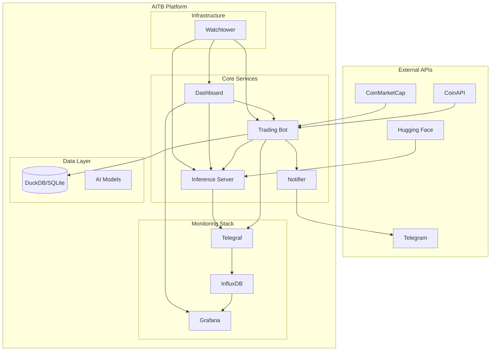

# AITB - AI Trading Bot Platform

> **⚠️ MANDATORY REQUIREMENT FOR ALL AGENTS:**  
> **Agents MUST read `/context/project_manifest.yaml` before any action.**  
> This file contains essential configuration, service definitions, and project guardrails.


[](https://github.com/aitb/releases)
[](LICENSE)
[](docker-compose.yml)
[](http://localhost:3001)

## 🚀 Overview

AITB (AI Trading Bot) is a comprehensive, containerized platform for automated cryptocurrency trading using artificial intelligence. The system combines multiple quantized AI models, real-time market data, and sophisticated risk management to execute profitable trading strategies.

### 🎯 Key Features

- **Multi-Model AI Engine**: Supports Qwen, Gemma, Mistral, SmolLM, and Granite models
- **Real-Time Trading**: Sub-second latency execution with advanced risk management
- **Comprehensive Monitoring**: InfluxDB + Grafana stack with custom dashboards
- **Telegram Notifications**: Real-time alerts for trades, profits, and system status
- **Auto-Recovery**: Graceful handling of power outages and system restarts
- **Performance Analytics**: PoFA scoring, drawdown analysis, and Sharpe ratio tracking
- **Docker Orchestration**: Full containerization with automated updates via Watchtower

## 🏗️ Architecture Overview



## 🛠️ Component Interconnections

### Core Trading Engine
- **Bot Service**: Main trading logic, market analysis, and order execution
- **Inference Server**: FastAPI-based ML model serving with ONNX Runtime
- **Dashboard**: React-based web interface for monitoring and control

### Data Management
- **DuckDB**: High-performance analytics on historical market data
- **SQLite**: Lightweight database for trades and configuration
- **Model Registry**: JSON-based metadata for AI model management

### Monitoring & Alerting
- **Telegraf**: Metrics collection from Docker, system resources, and applications
- **InfluxDB v2**: Time-series database for all metrics storage
- **Grafana**: Visualization dashboards with pre-built panels
- **Telegram Notifier**: Real-time alerts and trade notifications

### DevOps & Maintenance
- **Watchtower**: Automated container updates with rolling restarts
- **Docker Compose**: Complete orchestration with health checks
- **Backup Scripts**: Automated data backup and recovery procedures

## 🚀 Quick Start

### Prerequisites

- Docker & Docker Compose
- 8GB RAM minimum (16GB recommended)
- 50GB available disk space
- Internet connection for initial setup

### 1. Clone and Configure

```bash
# Clone the repository
git clone https://github.com/your-username/AITB.git
cd AITB

# Copy and configure environment
cp .env.example .env
nano .env  # Add your API keys
```

### 2. Required API Keys

Get these keys and add them to your `.env` file:

| Service | URL | Purpose |
|---------|-----|---------|
| CoinAPI | https://coinapi.io | Real-time market data |
| CoinMarketCap | https://coinmarketcap.com/api | Market rankings |
| Hugging Face | https://huggingface.co | AI model downloads |
| Telegram Bot | https://t.me/botfather | Notifications |

### 3. Launch Platform

```bash
# Start all services
docker compose up -d

# Check service health
docker compose ps

# View logs
docker compose logs -f bot
```

### 4. Access Interfaces

| Service | URL | Description |
|---------|-----|-------------|
| Dashboard | http://localhost:3000 | Trading interface |
| Grafana | http://localhost:3001 | Monitoring (admin/password) |
| Inference API | http://localhost:8001/docs | ML model API |
| InfluxDB | http://localhost:8086 | Database UI |

## 📊 Pre-Built Grafana Dashboards

### Trading Performance
- **Trade Latency & Slippage**: Real-time execution metrics
- **PnL Curves**: Profit/loss visualization with drawdown analysis
- **PoFA Score Distribution**: Performance analytics across timeframes

### System Monitoring
- **Resource Metrics**: CPU, memory, disk, and network usage
- **Container Health**: Service status and restart counts
- **Model Performance**: Inference latency and accuracy metrics

## 🗄️ Database Structure

### SQLite Tables
```sql
-- Trading data
trades.sqlite
├── trades          -- Executed trades with entry/exit
├── orders          -- Order book and execution details
├── portfolio       -- Portfolio positions and balances
└── config          -- Bot configuration and settings

-- Analytics data  
metrics.duckdb
├── market_data     -- OHLCV and technical indicators
├── model_predictions -- AI model outputs and confidence
├── performance     -- Strategy performance metrics
└── features        -- Engineered features for ML
```

### Data Folders
```
/data/
├── models/         -- Quantized AI models (ONNX format)
├── features/       -- Parquet files with engineered features
├── labels/         -- Training labels for model updates
└── db/            -- Database files and backups
```

## 🔄 Recovery Process

The system automatically handles recovery scenarios:

### After System Restart
1. **Container Auto-Start**: All services restart with proper dependencies
2. **Database Integrity Check**: Validates SQLite/DuckDB consistency
3. **State Recovery**: Resumes trading from last known position
4. **Model Reloading**: Restores AI models from registry
5. **Connection Recovery**: Reconnects to external APIs

### Recovery Logs
- `/logs/recovery.log`: Detailed recovery process
- `/logs/activity.log`: All system actions and builds
- `/logs/performance.log`: Weekly resource benchmarks

## 🔧 Configuration

### Trading Parameters
```bash
# Risk Management
MAX_POSITION_SIZE=0.02      # 2% of portfolio per trade
STOP_LOSS_PCT=0.05          # 5% stop loss
TAKE_PROFIT_PCT=0.15        # 15% take profit

# Active Models
ACTIVE_MODELS=qwen,gemma,mistral

# Performance Thresholds
MIN_ACCURACY=0.65
MIN_SHARPE_RATIO=1.5
```

### Model Configuration
Models are automatically managed through the registry:

```json
{
  "models": {
    "qwen-2b": {
      "path": "/app/data/models/qwen-2b.onnx",
      "accuracy": 0.68,
      "latency_ms": 45,
      "last_updated": "2024-10-23T10:30:00Z"
    }
  }
}
```

## 📈 Performance Optimization

### CPU Efficiency
- **ONNX Runtime**: Optimized inference with quantized models
- **Multi-threading**: Parallel processing for real-time analysis
- **Slim Images**: Alpine-based containers for reduced overhead

### Memory Management
- **Model Caching**: Efficient memory usage for multiple models
- **Data Streaming**: Chunked processing for large datasets
- **Garbage Collection**: Automated cleanup of temporary data

### Monitoring Thresholds
```bash
CPU_ALERT_THRESHOLD=80          # 80% CPU usage alert
MEMORY_ALERT_THRESHOLD=85       # 85% memory usage alert  
TRADE_LATENCY_THRESHOLD=500     # 500ms execution alert
```

## 🚨 Monitoring & Alerts

### Telegram Notifications
- ✅ Successful trades with P&L
- ⚠️ System warnings and errors
- 📊 Daily performance summaries
- 🔄 Container updates and restarts

### Grafana Alerts
- High latency detection
- Model accuracy degradation
- Resource usage spikes
- Exchange connectivity issues

## 🛡️ Security Features

- **API Key Encryption**: Secure storage of external API keys
- **Network Isolation**: Container-to-container communication only
- **Access Logging**: Complete audit trail of all actions
- **Backup Encryption**: Encrypted database backups

## 📚 Development & Collaboration

### AI Agent Collaboration
This project supports multi-AI collaboration:
- **User (Aamir)**: Orchestrator and strategic reviewer
- **VS Code Agent**: Builder, maintainer, and reporter  
- **External AI**: Strategy optimizer and enhancement advisor

### Interaction Logs
All AI-to-AI interactions are logged in `/docs/interaction_log.md` for full traceability.

### Modular Design
Every component is designed for AI comprehension:
- Self-documenting code with extensive comments
- README-driven development approach
- Standardized API interfaces
- Comprehensive logging and metrics

## 🔄 Continuous Enhancement

### Automated Updates
- **Nightly Container Updates**: Watchtower rebuilds outdated images
- **Weekly Performance Reports**: Automated benchmarking
- **Version Increment**: Automatic tagging with vX.Y.Z format
- **Changelog Generation**: Auto-generated from commit messages

### Optimization Cycle
1. **Collect Metrics**: Continuous performance monitoring
2. **Analyze Patterns**: Weekly automated analysis
3. **Suggest Improvements**: AI-driven optimization recommendations
4. **Implement Changes**: Backward-compatible updates
5. **Validate Performance**: A/B testing for improvements

## 📝 Changelog

### v1.0.0 (2024-10-23)
- Initial AITB platform release
- Multi-model AI inference engine
- Complete monitoring stack
- Telegram notification system
- Auto-recovery mechanisms
- Comprehensive documentation

## 🤝 Contributing

We welcome contributions! Please see [CONTRIBUTING.md](docs/CONTRIBUTING.md) for guidelines.

## 📄 License

This project is licensed under the MIT License - see the [LICENSE](LICENSE) file for details.

## 🆘 Support

- **Documentation**: [docs/](docs/)
- **Issues**: [GitHub Issues](https://github.com/your-username/AITB/issues)
- **Discussions**: [GitHub Discussions](https://github.com/your-username/AITB/discussions)

## ⚠️ Disclaimer

This software is for educational and research purposes. Cryptocurrency trading involves substantial risk of loss. Never trade with money you cannot afford to lose. The developers are not responsible for any financial losses incurred from using this software.

---

**Built with ❤️ by the AITB Team**

*Last updated: October 23, 2024*